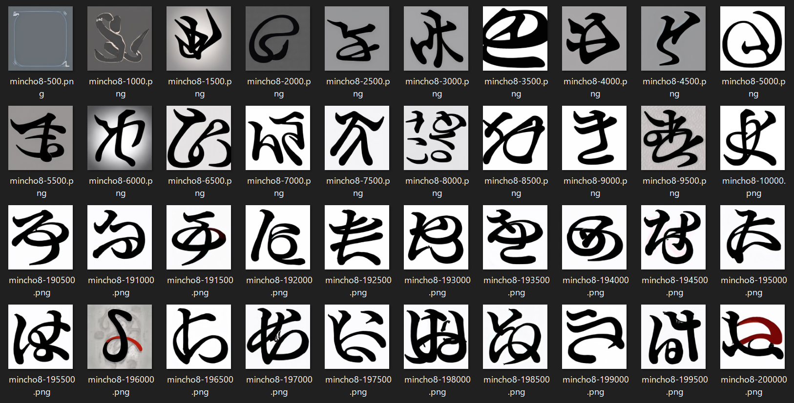

### 説明

異形明朝は、源ノ明朝Boldをもとに、Diffusion画像生成モデルACertainThingに明朝体の漢字と平仮名、片仮名をファインチューニングして生成したフォントです。ノイズから生成したIgyouMinchoとimg2imgで元の字形を留めたIgyouMincho2があります。ライセンスはSIL Open Font License 1.1であり、商用に使用できるほか、SIL Open Font License 1.1ライセンスを維持すれば改変、再配布も自由です。
デモページ：https://mikanixonable.github.io/18.html
フォントほぼ一覧：https://mikanixonable.github.io/4.html

### 学習の過程
漢字

片仮名

平仮名

### 使用例

